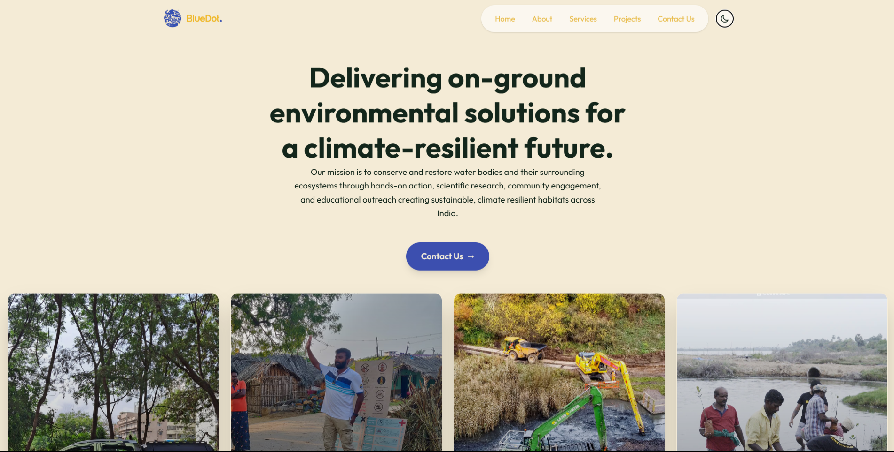

# BlueDot - Environmental Conservation Platform

## About The Website

This website serves as the comprehensive digital platform for **BlueDot**, an NGO dedicated to environmental conservation and sustainability. It is designed to engage the community, showcase impactful initiatives, and provide easy access to the organization's services.

### Key Features & Functions

*   **Project Showcase**: A dynamic portfolio displaying ongoing and completed conservation projects like *EcoSavaari*, *Laksha Vruksha*, and *Mangrove Plantations*. Each project page provides detailed insights into the initiative's goals and impact.
*   **Service Portfolio**: Dedicated sections for the various services offered by BlueDot, such as *Lake Conservation*, *Native Afforestation*, and *Wildlife Conservation*, allowing users to understand how they can contribute or benefit.
*   **Interactive Navigation**: Seamless routing and navigation powered by React Router, ensuring a smooth user experience across different sections of the site.
*   **Responsive Design**: A fully responsive layout built with Tailwind CSS, ensuring accessibility and optimal viewing on all devices, from desktops to mobile phones.
*   **Contact Integration**: Easy-to-use contact forms and floating action buttons to facilitate direct communication with the NGO for volunteering or inquiries.

## Tech Stack

This project is built using modern web technologies to ensure a fast, responsive, and engaging user experience:

*   **Framework**: [React](https://react.dev/) with [TypeScript](https://www.typescriptlang.org/)
*   **Build Tool**: [Vite](https://vitejs.dev/)
*   **Styling**: [Tailwind CSS](https://tailwindcss.com/)
*   **Animations**: [Framer Motion](https://www.framer.com/motion/)
*   **Routing**: [React Router](https://reactrouter.com/)
